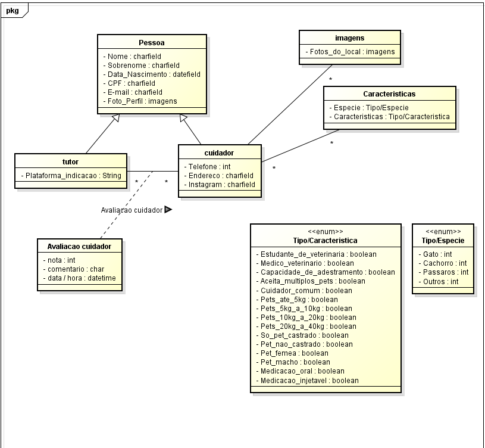

# Diagrama de Classe de Domínio

  

## Glossário 

|  Termo  |  Explicação  |
| ------- | ------------ |
| Pessoa | Usuário que está acessando a plataforma e vai realizar o cadastro. |   
| Tutor | Pessoa que deseja encontrar profissionais que possam cuidar do seu Pet por uma tempo. |   
| Cuidador | Profissional que presta serviço de cuidar de pets. Pode ser pessoa física ou empresa. |   
| Características | São todas as informações sobre o cuidador que o tutor vai poder selecionar quando for realizar a pesquisa. |   
| Imagens | São as imagens do ambiente onde os Pets serão recebidos pelos cuidadores. |   
| Avaliação Cuidador | Avaliação realizada pelo cuidador ao tutor após receber um (ou mais) Pet(s) de um tutor sob seus cuidados. |   
| Espécie | Espécie do pet que o cuidador aceita receber em sua residência sob seus cuidados. |