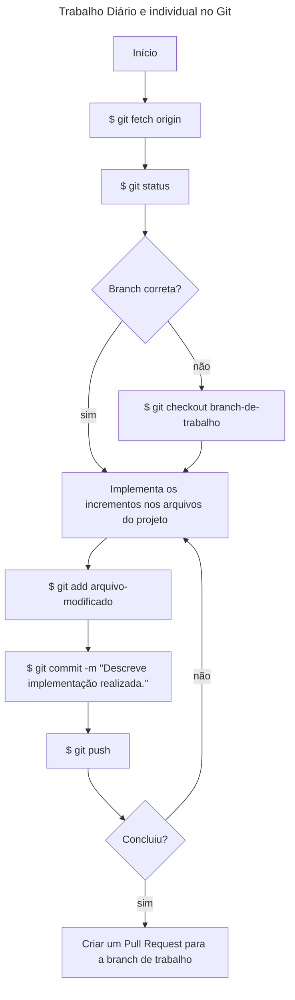

# Guia do Desenvolvedor 

**Histórico de Alterações:**
| Versão | Autor | Data |
|--------|-------|------|
|  1.0  | Felipe Aleixo | 30 de abril de 2023 |
|  1.1  | Anna Carolinne | 30 de maio de 2023 |   
 

# Projeto Nanny's Pets
  

## A. Preparativos para se trabalhar com o GitHub

1. Na sua máquina local DEVE ser verificada se já existem chaves SSH (previamente geradas) - [GUIA de como verificar a existência de chaves SSH](https://docs.github.com/pt/authentication/managing-commit-signature-verification/checking-for-existing-gpg-keys);
1. Não existindo, deve ser criado um par de chaves SSH - [GUIA de como criar chaves SSH](https://docs.github.com/pt/authentication/managing-commit-signature-verification/generating-a-new-gpg-key);
1. Uma vez criadas as chaves, a chave pública DEVE ser associada a uma conta do GitHub - [GUIA de como adicionar uma chave pública a uma conta do GitHub](https://docs.github.com/pt/authentication/managing-commit-signature-verification/adding-a-gpg-key-to-your-github-account);   
  

## B. Clonando o Projeto na Máquina Local

1. Antes de iniciar os trabalhos, o projeto precisa ser clonado na máquina local. Para tanto é necessário que o processo de configuração das chaves SSH tenha ocorrido anteriormente;
~~~shell
$ git clone https://github.com/tads-cnat/receber-pets.git
~~~
  
## C. Fluxo ao Ser Atribuído em Tarefas

1. Uma nova tarefa é atribuída a um desenvolvedor;
1. O desenvolvedor lê a tarefa e solicita possíveis esclarecimentos ao gerente a partir de comentários na tarefa, marcando o gerente;
1. **[opcional]** se a tarefa for considerada muito grande, a mesma "pode" ser quebrada em tarefas menores e atribuídas a um dos membros da equipe;
1. Para a realização da tarefa, DEVE ser criado um novo ramo (*branch*) do ramo principal (*main*). **Padrão**: ((num da issue))-nome-projeto - o que pode ser feito a partir da interface do GitHub;
1. As contribuições individuais DEVEM ser intergadas ao ramo de trabalho, através de *commits*;
1. Quando o trabalho atingir um nível intermediário, o gerente pode ser notificado do progresso a partir da abertura de uma solicitação de integração (*Pull Request*). O gerente deve ser atribuído como responsável pelo *Pull Request*;
1. O gerente pode avaliar as entregas parciais e esclarecer possíveis dúvidas ou solicitar correções através de comentários adicionados ao *Pull Request*, marcando o desenvolvedor rsposnável pelas correções;
1. O desenvolvedor responsável realiza as correções e ajustes solicitados e integra os mesmos através de novos *commits*;
1. Ao final do trabalho o *Pull Request* é sinalizado que não trata-se de um rascunho (*draft*);
1. O gerente integra o resultado do trabalho (contido na *branch* de trabalho) à *branch* princial (*main*).
  

## D. Passos do Trabalho Diário com o Git

- Inicialmente, o repositório local DEVE ser sincronizado com as possíveis novidades do repositório remoto (*origin*);
~~~shell
$ git fetch origin
~~~
- Deve ser verificado se o desenvolvedor se encontra da *branch* de trabalho;
~~~shell
$ git status
~~~ 
- Caso não esteja no lugar certo, deve acessar a *branch* de trabalho;
~~~shell
$ git checkout branch-de-trabalho
~~~
- Só então as contribuições no código poderão ser realizadas. Uma vez que as contribuições foram realizadas (edição de arquivos do projeto), as mesmas podem ser "salvas" no repositório;
~~~shell
$ git status
$ git add arquivo-modificado
$ git commit -m "Descrição resumo do que foi implementado."
~~~
- Ao finalizar o dia de trabalho, é uma boa prática que o repositório local seja sincronizado com o repositório remoto.
~~~shell
$ git push
~~~

